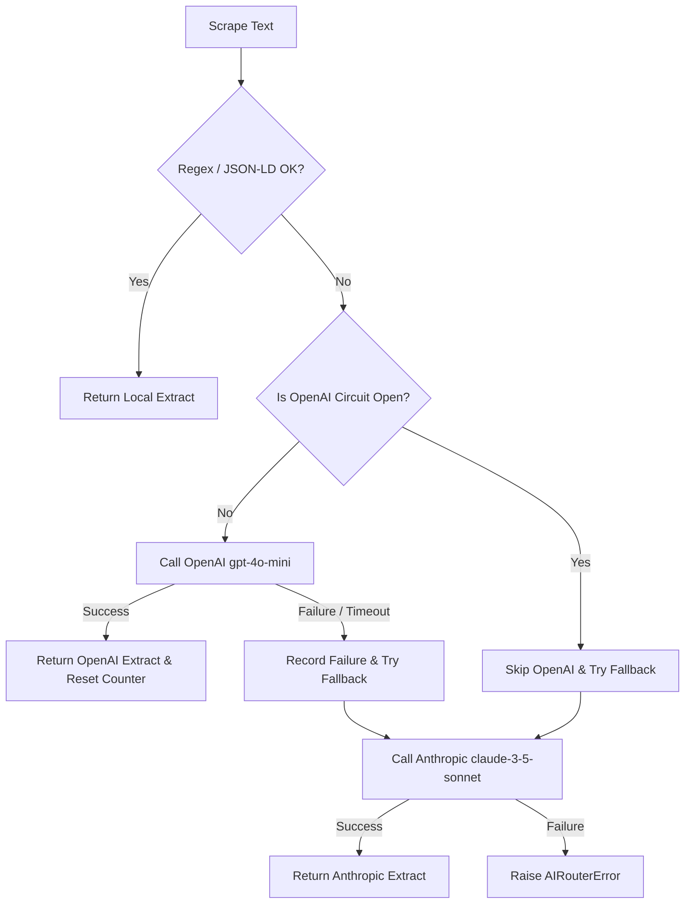

# Explanation: Architecture and Technical Decisions

This document describes the architectural design, trade-offs, and risk mitigation strategies implemented in the ERLI.PL Price Tracker.

---

## 1. System Architecture

The project is structured as a decoupled, event-driven async service. 

```
               ┌──────────────────────────────────────────┐
               │              FastAPI Server              │
               │  - REST Endpoints                        │
               │  - Uptime Monitoring (/health)           │
               └────────────────────┬─────────────────────┘
                                    │ (shares DB/bot config)
                                    ▼
┌──────────────┐       ┌──────────────────────────┐       ┌────────────────┐
│ APScheduler  │──────▶│       Parser Layer       │──────▶│   PostgreSQL   │
│ - Periodic   │       │  - JSON-LD Regex         │       │  - Products    │
│   scrapes    │       │  - AI Router Fallback    │       │  - PriceHistory│
└──────────────┘       └────────────┬─────────────┘       └────────┬───────┘
                                    │                              │
                                    ▼                              ▼
                       ┌──────────────────────────┐       ┌────────────────┐
                       │     Telegram Client      │◀──────│  PriceMonitor  │
                       │  - Bot UI Handler        │       │  - Delta check │
                       │  - Direct Chat Alerts    │       │  - Alert rule  │
                       └──────────────────────────┘       └────────────────┘
```

The app lifecycle is managed in [main.py](file:///C:/AI/ERLIPL_PRICE_TRACKE/src/main.py), where the FastAPI server, the background scheduler, and the Telegram bot polling are started concurrently in an async context manager.

---

## 2. Scraping and Parsing Strategy

Scraping e-commerce web pages is vulnerable to page structure changes and anti-bot systems. We use a multi-tiered approach:

### Tier 1: Serper.dev Scraping API
Instead of spinning up heavy headless browsers (like Selenium or Playwright) which consume massive server resources, the app delegates the scraping request to **Serper.dev**. Serper returns the rendered HTML/text content while managing proxies, user agents, and IP rotation automatically.

### Tier 2: Parser Layer (JSON-LD first)
We attempt to parse the page using fast, local regex patterns first.
1. The parser searches the raw HTML for `application/ld+json` script blocks containing Schema.org `Product` metadata.
2. If found, it extracts name, min/max price, and rating locally using Python regex.
3. This is local and takes `< 1ms`.

### Tier 3: AI Router (LLM Fallback)
If the regex parser fails (e.g. if ERLI.PL dynamically changes its HTML/JSON-LD layout or uses non-standard tags), the system falls back to the **AI Router**.
- The raw text of the page is passed to the AI Router.
- The router prompts the LLM to extract the product name, price, and rating.
- The primary LLM is **OpenAI `gpt-4o-mini`** because it is fast and cost-effective ($0.15/1M input tokens).

---

## 3. AI Router & Circuit Breaker Design

If OpenAI experiences an outage, high latency, or rate-limiting (HTTP 429), it would break price monitoring. To prevent this, we implemented a custom **AIRouter with a Circuit Breaker pattern**.



### Fallback Client
When OpenAI fails, the router catches the exception and immediately falls back to **Anthropic `claude-3-5-sonnet`**.
- It converts the canonical OpenAI chat format into Anthropic's message format.
- It returns the product details and logs the provider switch.

### Circuit Breaker States
1. **Closed (Normal)**: Requests go directly to OpenAI.
2. **Open (Failover)**: After **3 consecutive failures**, the circuit opens. OpenAI requests are skipped entirely, routing traffic directly to Anthropic to minimize request latency and prevent blocking the scheduler queue.
3. **Half-Open (Testing)**: After **60 seconds**, the circuit resets. The next request goes to OpenAI. If it succeeds, the circuit closes. If it fails, it reopens.

---

## 4. Risks & Mitigations

| Risk | Impact | Mitigation |
|---|---|---|
| **Serper credit exhaustion** | High | Configurable scraper throttling (1 request/sec delay) and interval config to fit the 2.5K free tier. |
| **Out-of-context LLM cost** | High | Anthropic fallback is ~20x more expensive than OpenAI. We use the circuit breaker to keep fallback times short and alert via Sentry if fallback rate exceeds 5%. |
| **Database pool starvation** | Medium | Managed using async SQLAlchemy connection pools (`pool_pre_ping=True`) with a fallback threshold. |
